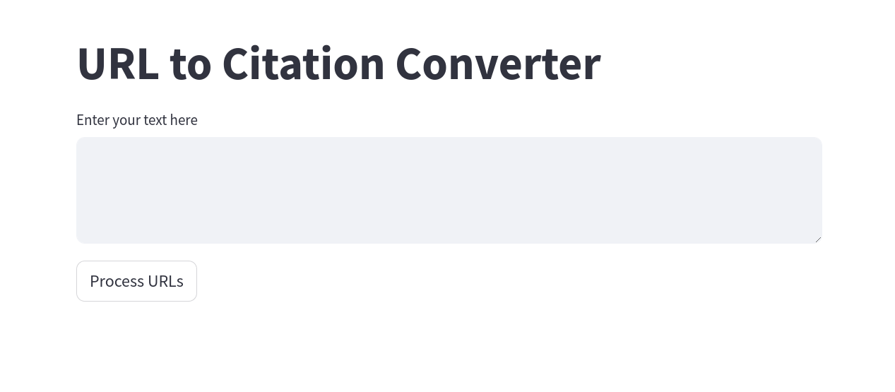
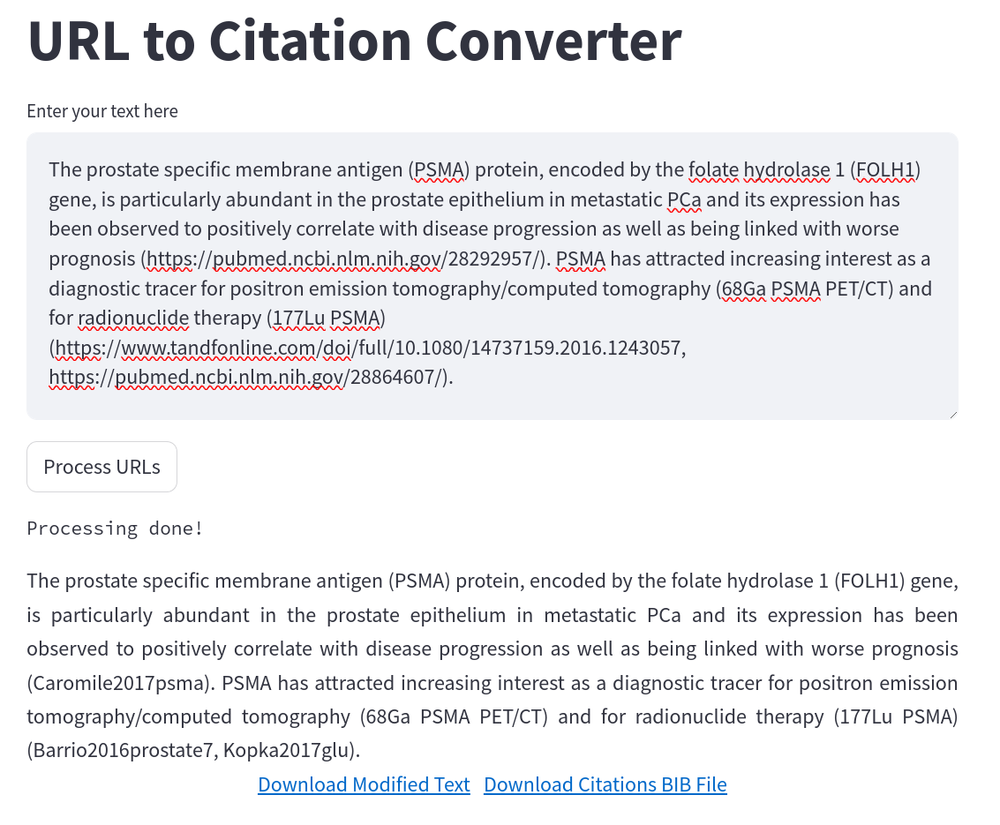

<div id="top"></div>

<!-- PROJECT LOGO -->
<br />
<div align="center">
  

  <h1 align="center">CiteLinks</h1>
  <h4 align="center">URL to Citation Converter</h4>

</div>

<!-- TABLE OF CONTENTS -->
<details>
  <summary>Table of Contents</summary>
  <ol>
    <li>
      <a href="#about-the-project">About The Project</a>
      <ul>
        <li><a href="#features">Features</a></li>
      </ul>
    </li>
    <li>
      <a href="#getting-started">Getting Started</a>
      <ul>
        <li><a href="#prerequisites">Prerequisites</a></li>
        <li><a href="#installation">Installation</a></li>
        <li><a href="#usage">Usage</a></li>
      </ul>
    </li>
    <li><a href="#additional-notes">Additional Notes</a></li>
    <li><a href="#license">License</a></li>
    <li><a href="#contact">Contact</a></li>
    <li><a href="#acknowledgments">Acknowledgments</a></li>
  </ol>
</details>

## About The Project

This is a simple Streamlit application that converts URLs in a given text to their corresponding BibTeX citations.

### Features

- **URL to Citation Conversion**: Enter a text containing URLs and the application will replace each URL with its corresponding BibTeX citation.
- **Download Citations**: The BibTeX citations can be downloaded as a `.bib` file.
- **Processing Indicator**: The application shows a message while it is processing the URLs.

<p align="right">(<a href="#top">back to top</a>)</p>

<!-- GETTING STARTED -->

## Getting Started

### Prerequisites

You should have an Anaconda environment installed in your UNIX system (currently only Ubuntu/CentOS has been tested). I recommend using `Miniforge3`:

```bash
wget https://github.com/conda-forge/miniforge/releases/latest/download/Miniforge3-Linux-x86_64.sh
bash Miniforge3-Linux-x86_64.sh
```

More detailed instructions to setup Anaconda using Miniforge3 can be found [in their GitHub page](https://github.com/conda-forge/miniforge).

### Installation

Here's a step-by-step guide to setup the library:

1. Clone this repository:

  ```bash
  git clone https://github.com/CarlosUziel/citelinks
  ```

2. Install mamba:

```bash
conda install -n base -c conda-forge mamba
```

3. Create virtual environment:

```bash
mamba env create -f environment.yml # alternatively try environment_hist.yml
mamba activate citelinks
```

4. The URL to citation conversion is done using a function from a `utils` module. Make sure this module is in your Python path when running the application. Set `PYTHONPATH` variable (preferably in your `.bashrc` file or equivalent):

```bash
export PYTHONPATH="/home/{user}/citelinks/src":$PYTHONPATH
```

5. Add path to your Firefox web driver (i.e. `geckodriver`) in `get_html_selenium` (**src/utils.py**):

```python
service = webdriver.FirefoxService(executable_path="path/to/geckodriver")
```

<!-- USAGE EXAMPLES -->

### Usage

1. Run the Streamlit application by executing the command `streamlit run main.py`.
2. Enter your text in the text area.
3. Click the "Process URLs" button.
4. Wait for the processing to complete. A message will be displayed while the processing is happening and will be updated once the processing is done.
5. The processed text, with URLs replaced by their corresponding BibTeX citations, will be displayed. The text is justified for better readability.
6. You can download the BibTeX citations as a `.bib` file by clicking the "Download Citations BIB File" link.

See example below:


<br>

**Note**: I use up to three different methods of obtaining the corresponding citation from a publication URL. However, I only tested this app with a few journals, so it is not guaranteed to work for all possible publication URLs. If it's not possible to obtain the citation from a certain URL, it will remain untouched in the final text.

<p align="right">(<a href="#top">back to top</a>)</p>

## Additional Notes

Source files formatted using the following commands:

```bash
isort .
autoflake -r --in-place --remove-unused-variable --remove-all-unused-imports --ignore-init-module-imports .
black .
```

<p align="right">(<a href="#top">back to top</a>)</p>

<!-- LICENSE -->

## License

Distributed under the MIT License. See `LICENSE` for more information.

<p align="right">(<a href="#top">back to top</a>)</p>

<!-- CONTACT -->

## Contact

[Carlos Uziel Pérez Malla](https://perez-malla.com/)

[GitHub](https://github.com/CarlosUziel) - [Google Scholar](https://scholar.google.es/citations?user=tEz_OeIAAAAJ&hl=es&oi=ao) - [LinkedIn](https://at.linkedin.com/in/carlos-uziel-p%C3%A9rez-malla-323aa5124) - [Twitter](https://twitter.com/perez_malla)

<p align="right">(<a href="#top">back to top</a>)</p>

## Acknowledgments

Thank you GitHub Copilot for allowing me to do this under a day, you rock!

<p align="right">(<a href="#top">back to top</a>)</p>
